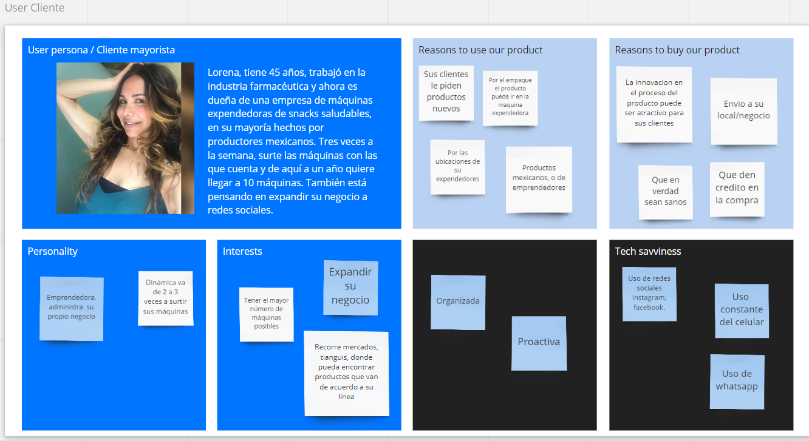

# Vidalís  

## Preámbulo

El bienestar es una de las industrias de más rápido crecimiento en la actualidad. Es considerada por expertos, como la consultora Euromonitor, como una de las 10 mayores tendencias globales en 2017. Varias empresas alrededor del mundo se han unido a la ola de salud y México no se ha quedado atrás.

## Introducción 

Vidalís es una de estas nuevas empresas que promueven una vida más saludable. Sus creadores son una pareja mexicana con un gran amor por la tierra y sus productos. Laura es una ingeniero químico industrial, mientras que Enrique proviene de la tercera generación de una familia exitosa de agricultores del Estado de México.

Siempre en la búsqueda de ofrecer una botana saludable y natural, Enrique desarrollÓ una nueva técnica de conservacion de alimentos por medios autosustentables. La particularidad e innovacion de los alimentos a diferencia de los alimentos deshidratados o la liofilización es que los vegetales, frutas y hortalizas Vidalís se mantienen en dormiciòn al extraer el agua por medios autosustentables y la CÉLULA SE MANTIENE VIVA, por lo tanto todas sus funciones organolepticas se mantienen al 100%.

##Problemas indentificados en la investigación

Al ser una empresa nueva que comenzará su operación comercial en noviembre de este año, nuestro principal objetivo es conectar a Vidalís a través de un canal de distribución como es el e-commerce con el cliente idóneo para que el producto tenga un mayor alcance y obtenga un excelente posicionamiento en el mercado mexicano.

En el proceso de investigación descubrimos las siguientes problemáticas:

### Insights 

## Definición del público objetivo

## Definición de la solución

### Anexos

[Presentación a clientes](http://bit.ly/PresentaciónVidalis)

[Prototipo](https://www.figma.com/proto/TkWIuUo3YLGdTiVjHnfnE9/Vidalis?node-id=12%3A1&scaling=scale-down-width)

[Documentación del proceso](http://bit.ly/DriveVidalis)

